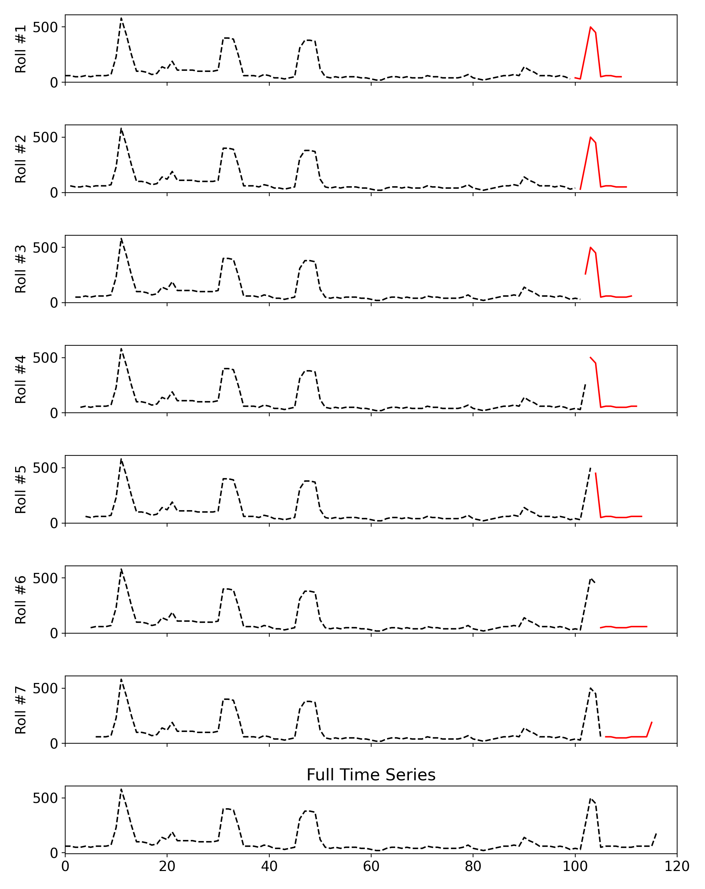

# TimeWarPY - Time Series Pre and Post Processing Methods

[](https://github.com/celmore25/TimeWarPY)
[](https://timewarpy.readthedocs.io/en/latest/)

## Background and Objective

TimeWarPy is a library I created because I kept running into time-series related pre and post processing that is discussed a lot in ML literature but not standardized in a popular ML library. Most industry related forecasting methods are not well suited for real-time deep learning architectures. TimeWarPy is a stab at making these operations both fast and convenient for real-time applications through an easy to use set of core processing objections.

## Installation

TimeWarPY can be installed directly with PyPi or directly from source [here](https://github.com/celmore25/TimeWarPY)

```
pip install timewarpy
```

## Motivation

### Univariate Data

Time series data sets for deep learning generally need to be put in the visual format below. There will be a sequence in time (vector) for training and a prediction sequence in time (another vector) that is normally shorter.


This single example is then rolled in time to generate many examples of these training and predicting sequences as shown below.


